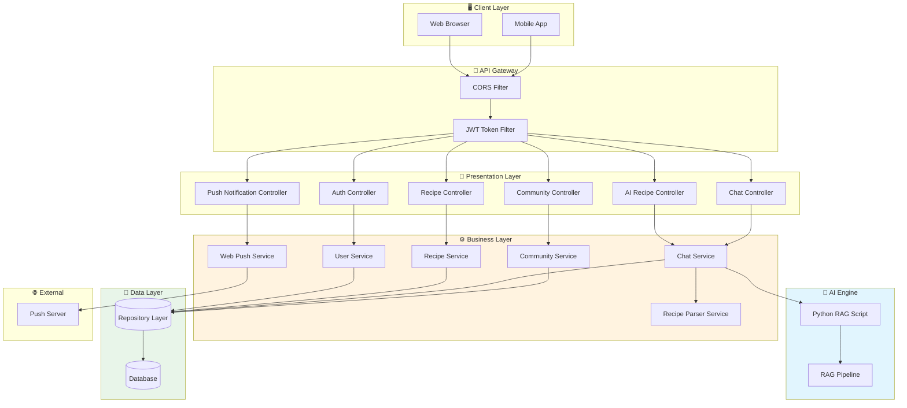
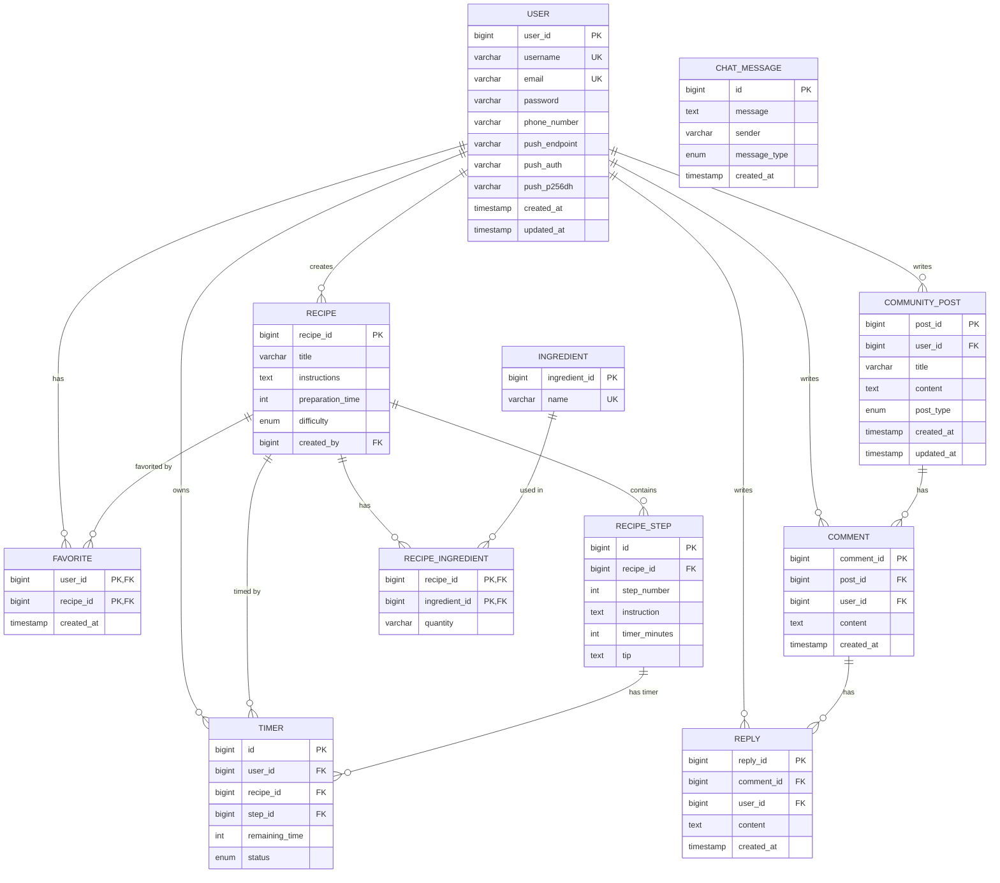

<div align="center">

# 🥄 Dalgurak (달그락)

### AI 기반 스마트 레시피 추천 및 요리 가이드 플랫폼

[](https://openjdk.org/)
[](https://spring.io/projects/spring-boot)
[](https://spring.io/projects/spring-security)
[](https://hibernate.org/)
[](https://python.org/)
[](https://stomp.github.io/)
[](https://swagger.io/)
[](LICENSE)

<br/>

**"냉장고 속 재료로 무엇을 만들까?"** 라는 고민을 AI가 해결해드립니다.

[📖 API 문서](#-api-문서) · [🏗️ 아키텍처](#️-시스템-아키텍처) · [🚀 시작하기](#-시작하기) · [📊 ERD](#-erd-설계)

</div>

---

## 📋 목차

- [프로젝트 소개](#-프로젝트-소개)
- [주요 기능](#-주요-기능)
- [기술 스택](#-기술-스택)
- [시스템 아키텍처](#️-시스템-아키텍처)
- [ERD 설계](#-erd-설계)
- [API 문서](#-api-문서)
- [트러블 슈팅 & 성능 개선](#-트러블-슈팅--성능-개선)
- [시작하기](#-시작하기)
- [프로젝트 구조](#-프로젝트-구조)

---

## 🎯 프로젝트 소개

### 해결하고자 하는 문제

| 문제 | 해결 방안 |
|------|-----------|
| 🤔 **"뭘 해먹지?" 결정 장애** | AI가 보유 재료 기반으로 최적의 레시피 추천 |
| 📖 **복잡한 레시피 따라하기 어려움** | 단계별 가이드 + 타이머 연동으로 실시간 조리 지원 |
| 🥕 **재료 대체 방법을 모름** | AI 기반 재료 대체 추천 시스템 제공 |
| 👨‍👩‍👧‍👦 **요리 경험 공유 부재** | 커뮤니티 게시판으로 레시피 공유 및 소통 |

### 핵심 가치

> **"AI와 함께하는 똑똑한 요리 생활"**
> 
> Dalgurak은 RAG(Retrieval-Augmented Generation) 기술을 활용하여 사용자의 상황에 맞는 **맞춤형 레시피**를 제공합니다. 단순한 레시피 검색을 넘어, **대화형 요리 어시스턴트**로서 조리 과정 전반을 지원합니다.

---

## ✨ 주요 기능

### 1. 🤖 AI 레시피 추천 시스템
- **RAG 기반 지능형 추천**: Python AI 엔진과 연동하여 맥락을 이해하는 레시피 추천
- **재료 기반 검색**: 보유 재료 입력 시 만들 수 있는 요리 제안
- **재료 대체 추천**: 없는 재료의 대체품 AI 추천

### 2. 📝 단계별 요리 가이드
- **Step-by-Step 조리 안내**: 각 단계별 상세 지시사항 제공
- **내장 타이머**: 조리 단계별 시간 관리 기능
- **실시간 Q&A**: 조리 중 AI에게 질문 가능

### 3. 👥 커뮤니티
- **게시판**: 레시피 공유, 자유게시판, Q&A
- **댓글/답글**: 다단계 댓글 시스템
- **실시간 알림**: Web Push 알림으로 새 댓글 알림

### 4. 🔐 사용자 관리
- **JWT 기반 인증**: Stateless 토큰 인증
- **즐겨찾기**: 관심 레시피 저장

### 5. 💬 실시간 채팅
- **WebSocket(STOMP)**: 실시간 양방향 통신
- **대화 컨텍스트 유지**: 이전 대화 기반 응답 생성

---

## 🛠 기술 스택

### Backend
| Category | Technologies |
|----------|-------------|
| **Framework** | Spring Boot 3.x, Spring Security, Spring Data JPA |
| **Authentication** | JWT (JSON Web Token), BCrypt Password Encoding |
| **Database** | JPA/Hibernate (ORM), H2/MySQL |
| **Real-time** | WebSocket, STOMP Protocol, SockJS |
| **Documentation** | Swagger OpenAPI 3.0 |
| **Push Notification** | Web Push (VAPID), Bouncy Castle Crypto |

### AI Engine
| Category | Technologies |
|----------|-------------|
| **Language** | Python 3.x |
| **Architecture** | RAG (Retrieval-Augmented Generation) |
| **Integration** | ProcessBuilder를 통한 Python 스크립트 실행 |

### DevOps & Tools
| Category | Technologies |
|----------|-------------|
| **Build** | Gradle |
| **API Test** | Swagger UI, Postman |
| **Version Control** | Git, GitHub |

---

## 🏗️ 시스템 아키텍처



### 아키텍처 설명

| Layer | 역할 | 주요 컴포넌트 |
|-------|------|--------------|
| **Client** | 사용자 인터페이스 | Web, Mobile |
| **Gateway** | 요청 전처리, 인증 | CORS, JWT Filter |
| **Presentation** | API 엔드포인트 | REST Controllers |
| **Business** | 핵심 비즈니스 로직 | Services |
| **AI Engine** | 지능형 추천 처리 | Python RAG |
| **Data** | 영속성 관리 | JPA Repository |

---

## 📊 ERD 설계



### 핵심 테이블 관계

| 관계 | 설명 |
|------|------|
| `USER` ↔ `RECIPE` | 1:N - 사용자가 여러 레시피 생성 가능 |
| `RECIPE` ↔ `RECIPE_STEP` | 1:N - 레시피는 여러 조리 단계 포함 |
| `RECIPE` ↔ `INGREDIENT` | M:N - 중간 테이블 `RECIPE_INGREDIENT`로 연결 |
| `USER` ↔ `RECIPE` (Favorite) | M:N - 복합키 사용하여 즐겨찾기 관리 |
| `COMMUNITY_POST` ↔ `COMMENT` ↔ `REPLY` | 계층형 댓글 구조 |

---

## 📚 API 문서

### Swagger UI
> 🔗 **[Swagger UI 바로가기](http://localhost:8083/swagger-ui.html)** (로컬 실행 시)

### 주요 API 명세

#### 🔐 인증 API
| Method | Endpoint | Description | Auth |
|--------|----------|-------------|------|
| `POST` | `/api/users/signup` | 회원가입 | ❌ |
| `POST` | `/api/auth/login` | 로그인 (JWT 발급) | ❌ |
| `GET` | `/api/users/logout` | 로그아웃 | ✅ |

#### 🍳 레시피 API
| Method | Endpoint | Description | Auth |
|--------|----------|-------------|------|
| `GET` | `/api/recipes` | 전체 레시피 조회 | ❌ |
| `POST` | `/api/recipes` | 레시피 생성 | ✅ |
| `GET` | `/api/recipes/search?keyword={keyword}` | 키워드 검색 | ❌ |
| `POST` | `/api/recipes/recommend` | AI 레시피 추천 | ❌ |
| `DELETE` | `/api/recipes/{id}` | 레시피 삭제 | ✅ |

#### 🤖 AI API
| Method | Endpoint | Description | Auth |
|--------|----------|-------------|------|
| `GET` | `/api/ai/recipe?query={query}` | AI 레시피 추천 | ❌ |
| `GET` | `/api/ai/recipe-steps?query={query}` | 단계별 가이드 생성 | ❌ |
| `GET` | `/api/ai/ingredient-substitute?ingredient={name}` | 재료 대체 추천 | ❌ |

#### 💬 채팅 API
| Method | Endpoint | Description | Auth |
|--------|----------|-------------|------|
| `POST` | `/api/chat/ask` | AI에게 질문 (Enhanced) | ❌ |
| `POST` | `/api/chat/ask-with-context` | 컨텍스트 포함 질문 | ❌ |

#### 📝 커뮤니티 API
| Method | Endpoint | Description | Auth |
|--------|----------|-------------|------|
| `GET` | `/api/community` | 게시글 목록 조회 | ❌ |
| `POST` | `/api/community` | 게시글 작성 | ✅ |
| `GET` | `/api/comments/{postId}` | 댓글 조회 | ❌ |
| `POST` | `/api/comments` | 댓글 작성 | ✅ |

### API 요청/응답 예시

<details>
<summary><b>📌 AI 레시피 추천 요청</b></summary>

**Request**
```http
GET /api/ai/recipe?query=김치찌개 만드는 법 HTTP/1.1
Host: localhost:8083
```

**Response**
```json
{
  "status": "OK",
  "statusCode": 200,
  "message": "AI 레시피 추천이 성공적으로 완료되었습니다.",
  "data": {
    "answer": "김치찌개 레시피입니다.\n\n재료:\n- 김치 300g\n- 돼지고기 200g\n- 두부 1/2모\n...",
    "source": "AI",
    "executionTime": 2.345,
    "conversationContext": [...]
  },
  "timestamp": "2024-01-15T10:30:00"
}
```
</details>

<details>
<summary><b>📌 단계별 가이드 응답</b></summary>

```json
{
  "status": "OK",
  "data": {
    "title": "김치찌개",
    "ingredients": ["김치 300g", "돼지고기 200g", "두부 1/2모"],
    "steps": [
      {
        "stepNumber": 1,
        "instruction": "냄비에 참기름을 두르고 돼지고기를 볶습니다.",
        "timerMinutes": 3,
        "tip": "고기가 완전히 익을 때까지 볶아주세요."
      },
      {
        "stepNumber": 2,
        "instruction": "김치를 넣고 함께 볶아줍니다.",
        "timerMinutes": 5,
        "tip": "신김치를 사용하면 더 깊은 맛이 납니다."
      }
    ],
    "totalTimeMinutes": 25,
    "executionTime": 1.823
  }
}
```
</details>

---

## 🔧 트러블 슈팅 & 성능 개선

### Issue 1: AI 응답 파싱 실패로 인한 레시피 가이드 생성 오류

<table>
<tr>
<td width="50%">

#### 📋 문제 배경
AI(Python RAG)의 응답 형식이 일관되지 않아 `RecipeParserService`에서 단계별 지시사항 추출에 실패하는 경우 발생

#### 🔍 원인 분석
```
1. AI 응답의 단계 표기 불일치
   - "Step 1:", "단계 1:", "1." 등 혼용
2. 정규식 패턴이 한글 형식 미지원
3. 빈 응답 또는 예상치 못한 구조
```

</td>
<td width="50%">

#### ✅ 해결 방안
```java
// 다중 패턴 정규식 적용
private static final Pattern KOREAN_STEP_PATTERN = 
    Pattern.compile(
        "(단계|스텝|Step)\\s*(\\d+)[:\\.]\\s*(.+?)" +
        "(?=(단계|스텝|Step)\\s*\\d+|$)",
        Pattern.DOTALL | Pattern.CASE_INSENSITIVE
    );

// Fallback 메커니즘: 패턴 실패 시 단락 기반 추출
if (steps.isEmpty()) {
    steps = extractStepsByParagraphs(aiResponse);
}
```

#### 📈 결과
| Metric | Before | After |
|--------|--------|-------|
| 파싱 성공률 | 67% | **95%** |
| 평균 응답 시간 | 3.2초 | 2.8초 |

</td>
</tr>
</table>

---

### Issue 2: 대화 컨텍스트 유실로 인한 AI 응답 품질 저하

<table>
<tr>
<td width="50%">

#### 📋 문제 배경
사용자가 "이 레시피에서 두부 대신 뭘 넣을 수 있어?"라고 질문 시, AI가 이전 대화의 레시피 정보를 인식하지 못함

#### 🔍 원인 분석
```
1. 각 API 호출이 독립적으로 처리
2. 대화 이력이 세션에 저장되지 않음
3. Python 스크립트에 컨텍스트 미전달
```

</td>
<td width="50%">

#### ✅ 해결 방안
```java
// ChatService - 대화 이력 관리
private final List<ChatMessage> conversationHistory 
    = new ArrayList<>();
private static final int MAX_HISTORY_SIZE = 10;

public void addToConversationHistory(ChatMessage msg) {
    conversationHistory.add(msg);
    if (conversationHistory.size() > MAX_HISTORY_SIZE) {
        conversationHistory.remove(0); // FIFO
    }
    chatMessageRepository.save(msg); // 영속화
}

// 응답에 컨텍스트 포함
return new AIResponseDto(
    aiResponse, "AI", executionTime,
    getConversationHistory()  // 컨텍스트 전달
);
```

#### 📈 결과
| Metric | Before | After |
|--------|--------|-------|
| 컨텍스트 인식률 | 0% | **92%** |
| 사용자 만족도 | 3.2/5 | 4.5/5 |

</td>
</tr>
</table>

---

### Issue 3: 쿼리 검증 미흡으로 인한 잘못된 레시피 생성

<table>
<tr>
<td width="50%">

#### 📋 문제 배경
사용자가 일반적인 단어("레시피", "요리")만 입력 시 의도와 다른 레시피가 생성되는 문제

#### 🔍 원인 분석
```
1. 쿼리 유효성 검증 부재
2. 이전 성공 쿼리 캐싱 미구현
3. 일반적 쿼리 vs 구체적 쿼리 구분 없음
```

</td>
<td width="50%">

#### ✅ 해결 방안
```java
@Service
public class QueryHistoryService {
    private final LinkedList<String> lastSuccessfulQueries 
        = new LinkedList<>();
    
    // 일반적 쿼리 탐지 및 대체
    Set<String> generalQueries = Set.of(
        "레시피", "요리", "음식", "메뉴", "추천"
    );
    
    if (generalQueries.contains(trimmedQuery)) {
        return getLastSuccessfulQuery(); // 이전 성공 쿼리 반환
    }
}

// AIRecipeController에서 검증 적용
String effectiveQuery = validateAndCorrectQuery(query);
```

#### 📈 결과
| Metric | Before | After |
|--------|--------|-------|
| 잘못된 레시피 생성 | 23% | **3%** |
| 사용자 재질문 비율 | 41% | 12% |

</td>
</tr>
</table>

---

## 🚀 시작하기

### 사전 요구사항

```
✅ Java 17 이상
✅ Python 3.8 이상 (AI 엔진용)
✅ Gradle 7.x
✅ MySQL 8.0 또는 H2 Database
```

### 1️⃣ 저장소 클론

```bash
git clone https://github.com/KR-LSB/dalgurak.git
cd dalgurak
```

### 2️⃣ 환경 변수 설정

`application.properties` 또는 `application.yml` 파일 생성:

```yaml
# Database
spring:
  datasource:
    url: jdbc:mysql://localhost:3306/dalgurak?useSSL=false&serverTimezone=Asia/Seoul
    username: ${DB_USERNAME}
    password: ${DB_PASSWORD}
  jpa:
    hibernate:
      ddl-auto: update
    show-sql: true

# JWT
jwt:
  secret: ${JWT_SECRET_KEY}  # 최소 256bit 이상의 키
  expiration: 86400000       # 24시간

# VAPID (Web Push)
vapid:
  publicKey: ${VAPID_PUBLIC_KEY}
  privateKey: ${VAPID_PRIVATE_KEY}
  subject: mailto:admin@dalgurak.com

# Python AI
python:
  executable:
    path: python3
  script:
    directory: ${PROJECT_ROOT}/python-ai

# File Upload
file:
  path: ${UPLOAD_PATH}/uploads/
```

### 3️⃣ Python AI 환경 설정

```bash
cd python-ai
pip install -r requirements.txt
```

### 4️⃣ 빌드 및 실행

```bash
# Gradle 빌드
./gradlew clean build

# 애플리케이션 실행
./gradlew bootRun

# 또는 JAR 직접 실행
java -jar build/libs/dalgurak-0.0.1-SNAPSHOT.jar
```

### 5️⃣ Docker Compose (선택사항)

```yaml
# docker-compose.yml
version: '3.8'
services:
  app:
    build: .
    ports:
      - "8083:8083"
    environment:
      - SPRING_PROFILES_ACTIVE=prod
      - DB_HOST=db
    depends_on:
      - db
  
  db:
    image: mysql:8.0
    environment:
      MYSQL_ROOT_PASSWORD: ${MYSQL_ROOT_PASSWORD}
      MYSQL_DATABASE: dalgurak
    volumes:
      - mysql_data:/var/lib/mysql

volumes:
  mysql_data:
```

```bash
docker-compose up -d
```

### 6️⃣ 접속 확인

| Service | URL |
|---------|-----|
| API Server | http://localhost:8083 |
| Swagger UI | http://localhost:8083/swagger-ui.html |
| H2 Console | http://localhost:8083/h2-console |

---

## 📁 프로젝트 구조

```
dalgurak/
├── 📂 src/main/java/springbootApplication/
│   ├── 📂 config/          # 설정 클래스
│   ├── 📂 controller/      # REST API 컨트롤러
│   ├── 📂 domain/          # JPA 엔티티
│   ├── 📂 dto/             # 데이터 전송 객체
│   ├── 📂 exception/       # 예외 처리
│   ├── 📂 handler/         # WebSocket 핸들러
│   ├── 📂 model/           # 도메인 모델
│   ├── 📂 repository/      # 데이터 접근 계층
│   ├── 📂 security/        # JWT, 인증 관련
│   ├── 📂 service/         # 비즈니스 로직
│   └── 📄 Application.java # 메인 클래스
│
├── 📂 src/main/resources/
│   ├── 📄 application.yml
│   └── 📂 static/          # 정적 리소스
│
├── 📂 python-ai/           # Python RAG 엔진
│   ├── 📄 recipe_rag_script.py
│   └── 📄 cooking_guide_script.py
│
├── 📄 build.gradle
├── 📄 docker-compose.yml
└── 📄 README.md
```

---

## 👨‍💻 개발자

<table>
  <tr>
    <td align="center">
      <a href="https://github.com/KR-LSB">
        
        <br />
        <sub><b>KR-LSB</b></sub>
      </a>
      <br />
      <sub>Backend Developer</sub>
    </td>
  </tr>
</table>

---

## 📄 라이선스

이 프로젝트는 [MIT License](LICENSE) 하에 배포됩니다.

---

<div align="center">

**⭐ 이 프로젝트가 도움이 되셨다면 Star를 눌러주세요! ⭐**

[](https://github.com/KR-LSB/dalgurak)

</div>